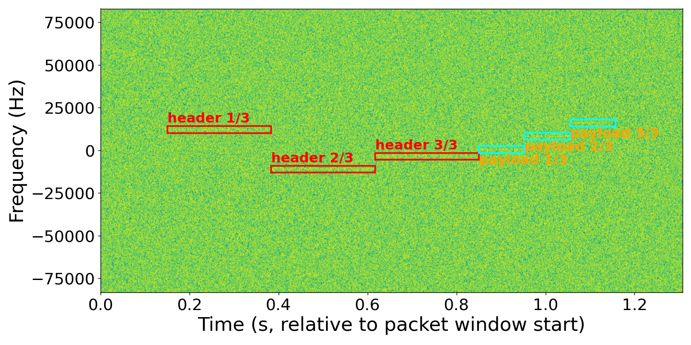

# PyLR-FHSS

[](https://github.com/ShayanMajumder/LR-FHSS/actions/workflows/ci.yml)
[](https://pypi.org/project/lrfhss/)
[](https://pypi.org/project/lrfhss/)
[](https://github.com/ShayanMajumder/LR-FHSS/blob/main/LICENSE)

A blind LR-FHSS receiver. Given raw IQ, it finds packets without being told
where they are: matched-filter sync search, header decode, then the
LFSR-predicted hop schedule to gather and decode the payload.




Both are the bundled recording, a real over-the-air packet carrying
"hello world", decoded and drawn by `examples/decode_recording.py`. Each box
marks where the receiver found a header replica (red) or a payload fragment
(cyan).

- **Top: as captured.** Three header replicas, then three payload fragments,
  each a narrow line on its own hop frequency.
- **Bottom: buried in noise.** The same capture with white noise added down
  to -22 dB SNR, so the signal is about 160 times weaker than the noise in a
  125 kHz reference bandwidth. The packet is invisible, yet the receiver
  still finds it without being told where to look, locks onto it and decodes
  the payload with a passing CRC. The boxes land where they did in the clean
  capture.

Why it survives: each hop is only about 488 Hz wide. Filtering down to one
hop throws away 99.6% of the noise in 125 kHz, which leaves an SNR of about
+2 dB inside the hop. The header is sent three times and the copies are
combined, and the payload is protected by convolutional coding and a CRC.
For comparison, LoRa's most robust setting, SF12, is specified down to
-20 dB SNR.

-22 dB is near this packet's limit, so whether it decodes depends on the
noise draw. To try it, set `SNR_DB` and `NOISE_SEED` at the top of the
script.

## Install

Python 3.10+:

```bash
pip install lrfhss            # or "lrfhss[plots]" for the spectrogram plots
```

Wheels for Linux, macOS and Windows include the compiled core
(`lrfhss._viterbi_ext`), which the hot paths use automatically. To work on
the code instead, install from a clone, which needs a C++ compiler:

```bash
git clone https://github.com/ShayanMajumder/LR-FHSS.git
cd LR-FHSS
python3 -m venv venv
source venv/bin/activate
pip install -e ".[test]"      # add ",plots" for matplotlib
```

The compiled core is an accelerator, not a requirement: if it cannot be
built, the install still succeeds and everything runs on numpy, bit-for-bit
identical, just several times slower (`LRFHSS_NO_EXT=1` skips the build on
purpose). The fallback is silent, so to check:

```bash
python3 -c "import lrfhss; print(lrfhss.config._HAVE_VEXT_LOCAL)"
```

Live SDR reception additionally needs SoapySDR, which is a system package
rather than a pip one -- see [`examples/arduino/`](https://github.com/ShayanMajumder/LR-FHSS/tree/main/examples/arduino) and
`examples/live_receive.py`.

## Decode a capture

```python
import lrfhss

lrfhss.config.retune(722_660, sync_word='12AD101B', hdr_count=4)

for packet in lrfhss.decode('capture.wav'):
    if packet['crc']:
        print(bytes(packet['bytes']))
```

Two things the receiver cannot work out for itself:

- **bandwidth**, which sets the sample rate, symbol length and dwell times.
- **`hdr_count`**, the number of header replicas (1-4). It is not carried in
  the header, and a wrong value puts the payload window a whole dwell out.

Grid and coding rate *are* in the header, so they are not settings. For
standards-compliant traffic, `retune_dr(8)` or `retune_dr(5, region='US915')`
sets everything at once, replica count included.

`decode()` returns every candidate it considered; `packet['crc']` is the
accept gate. The rejects come back too, because they are what you need when
a capture will not decode.

## Generate a packet

```python
iq, meta = lrfhss.encode(b'hello world', dr=8)
iq, meta = lrfhss.encode(b'hello world', bw_khz=722.66, CR=0)
```

The encoder reuses the decoder's own trellis, CRC, whitening and interleaver,
so the two are compatible by construction.

## Examples

```bash
python3 examples/decode_recording.py   # the bundled recording, no setup
python3 examples/encode.py             # generate a packet and decode it back
python3 examples/live_receive.py       # decode off an SDR, live
```

Each is a flat script: edit the settings block at the top and run it.
[`examples/arduino/`](https://github.com/ShayanMajumder/LR-FHSS/tree/main/examples/arduino) has two transmitter sketches, for an
STM32 with an SX1262 or an LR1120, to give `live_receive.py` something to
hear.

## Tests

```bash
pytest              # 99 tests, ~45 s
```

Self-contained: nothing is skipped and nothing needs external data. CI runs
them on Linux, macOS and Windows for every push and pull request.

## Layout

```
lrfhss/
  config       every retunable parameter, retune(), DR tables
  frontend     decimating channeliser        dsp        filters, notching
  detect       matched filter, CFAR, sync    header     header decode, CFO
  payload      payload window and decode     quality    energy/length checks
  acquire      IQ + candidates               arbitrate  which are real packets
  pipeline     decode() -- orders the above  encoder    encode()
  sdr          LiveReceiver (optional)       plotting   spectrograms
  phy/         hopping, fec, gmsk, framing -- protocol primitives
src/           C++ core, one file per role
examples/      runnable scripts
```

`arbitrate` is the one to read first if you are changing behaviour: one
physical packet appears as several candidates, and deciding which are real is
where this receiver has historically gone wrong.

## Collaboration and support

Open to collaborations :) If you would like some personal support replicating
these results, let me know: [shayan.majumder2@gmail.com](mailto:shayan.majumder2@gmail.com).

## Acknowledgements

Thanks to the [Microwaves and Engineering group](https://microwaves.site.hw.ac.uk/)
at Heriot-Watt University for supporting this work, and to
[jumanamirza/LR-FHSS-receiver](https://github.com/jumanamirza/LR-FHSS-receiver) for making her work open source.

## License

MIT, see [LICENSE](https://github.com/ShayanMajumder/LR-FHSS/blob/main/LICENSE).

Shayan Majumder <shayan.majumder2@gmail.com>

## Citation

If you use PyLR-FHSS in your research, please cite:

> S. Majumder, H. Sayed, G. Goussetis, and S. N. Daskalakis, "Open-Source
> Python Implementation of LR-FHSS for Ubiquitous Space-IoT Connectivity,"
> Oct. 09, 2026, Zenodo. doi: [10.5281/zenodo.23271166](https://doi.org/10.5281/zenodo.23271166).

```bibtex
@misc{majumder2026pylrfhss,
  author    = {Majumder, Shayan and Sayed, Hamza and Goussetis, George and Daskalakis, Spyridon N.},
  title     = {{Open-Source Python Implementation of LR-FHSS for Ubiquitous Space-IoT Connectivity}},
  publisher = {Zenodo},
  year      = {2026},
  month     = oct,
  doi       = {10.5281/zenodo.23271166},
  url       = {https://doi.org/10.5281/zenodo.23271166}
}
```
