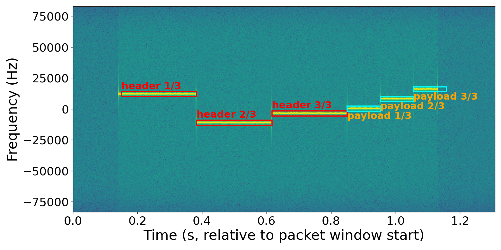

# lrfhss

A blind LR-FHSS receiver. Given raw IQ, it finds packets without being told
where they are: matched-filter sync search, header decode, then the
LFSR-predicted hop schedule to gather and decode the payload.



The bundled recording, decoded and drawn by `examples/decode_recording.py`:
three header replicas (red), then three payload fragments (cyan), each boxed
where the receiver found it.

## Install

Python 3.9+ and a C++ compiler:

```bash
python3 -m venv venv
source venv/bin/activate
pip install -e .              # add ".[test]" for pytest, ".[plots]" for matplotlib
```

That also compiles `src/*.cpp` into `lrfhss._viterbi_ext`, which the hot
paths use automatically. It is an accelerator, not a requirement: without it
everything still runs on numpy, bit-for-bit identical, just several times
slower. The fallback is silent, so to check:

```bash
python3 -c "import lrfhss; print(lrfhss.config._HAVE_VEXT_LOCAL)"
```

Live SDR reception additionally needs SoapySDR, which is a system package
rather than a pip one -- see [`examples/arduino/`](examples/arduino) and
`examples/live_receive.py`.

## Decode a capture

```python
import lrfhss

lrfhss.config.retune(722_660, sync_word='12AD101B', hdr_count=4)

for packet in lrfhss.decode('capture.wav'):
    if packet['crc']:
        print(bytes(packet['bytes']))
```

Two things the receiver cannot work out for itself:

- **bandwidth**, which sets the sample rate, symbol length and dwell times.
- **`hdr_count`**, the number of header replicas (1-4). It is not carried in
  the header, and a wrong value puts the payload window a whole dwell out.

Grid and coding rate *are* in the header, so they are not settings. For
standards-compliant traffic, `retune_dr(8)` or `retune_dr(5, region='US915')`
sets everything at once, replica count included.

`decode()` returns every candidate it considered; `packet['crc']` is the
accept gate. The rejects come back too, because they are what you need when
a capture will not decode.

## Generate a packet

```python
iq, meta = lrfhss.encode(b'hello world', dr=8)
iq, meta = lrfhss.encode(b'hello world', bw_khz=722.66, CR=0)
```

The encoder reuses the decoder's own trellis, CRC, whitening and interleaver,
so the two are compatible by construction. Known bug, pinned by a strict
xfail: CR=0 generation depends on payload content (see `lrfhss/encoder.py`).

## Examples

```bash
python3 examples/decode_recording.py   # the bundled recording, no setup
python3 examples/encode.py             # generate a packet and decode it back
python3 examples/live_receive.py       # decode off an SDR, live
```

Each is a flat script: edit the settings block at the top and run it.
[`examples/arduino/`](examples/arduino) has two transmitter sketches, for an
STM32 with an SX1262 or an LR1120, to give `live_receive.py` something to
hear.

## Tests

```bash
pytest              # 88 tests, ~55 s
```

Self-contained: nothing is skipped and nothing needs external data.

## Layout

```
lrfhss/
  config       every retunable parameter, retune(), DR tables
  frontend     decimating channeliser        dsp        filters, notching
  detect       matched filter, CFAR, sync    header     header decode, CFO
  payload      payload window and decode     quality    energy/length checks
  acquire      IQ + candidates               arbitrate  which are real packets
  pipeline     decode() -- orders the above  encoder    encode()
  sdr          LiveReceiver (optional)       plotting   spectrograms
  phy/         hopping, fec, gmsk, framing -- protocol primitives
src/           C++ core, one file per role
examples/      runnable scripts
```

`arbitrate` is the one to read first if you are changing behaviour: one
physical packet appears as several candidates, and deciding which are real is
where this receiver has historically gone wrong.
