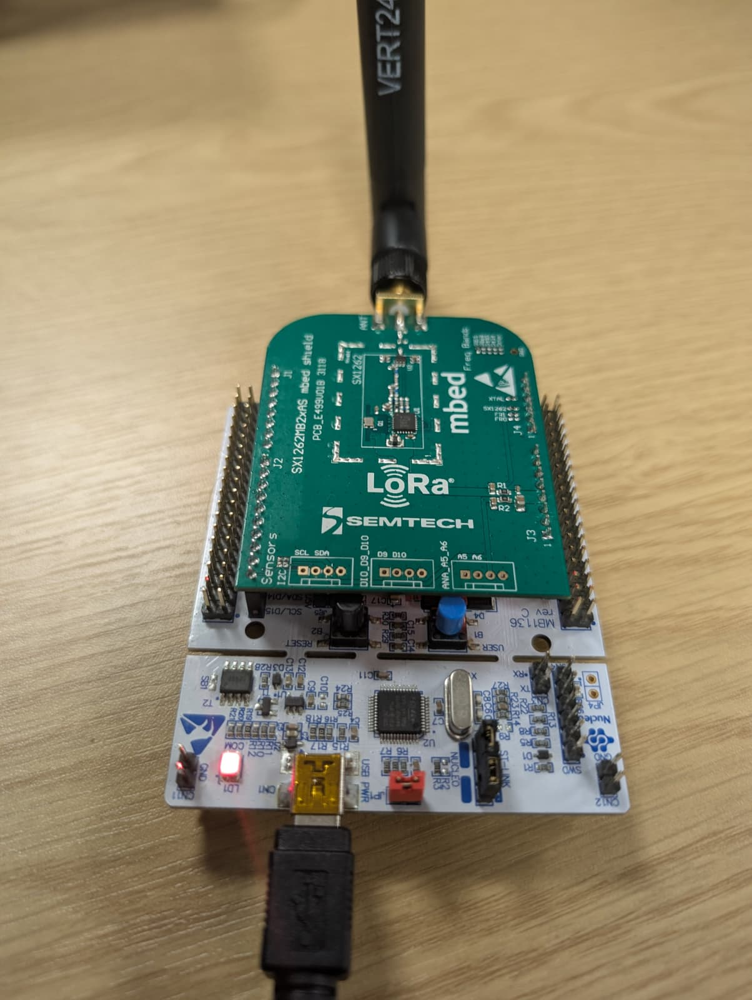
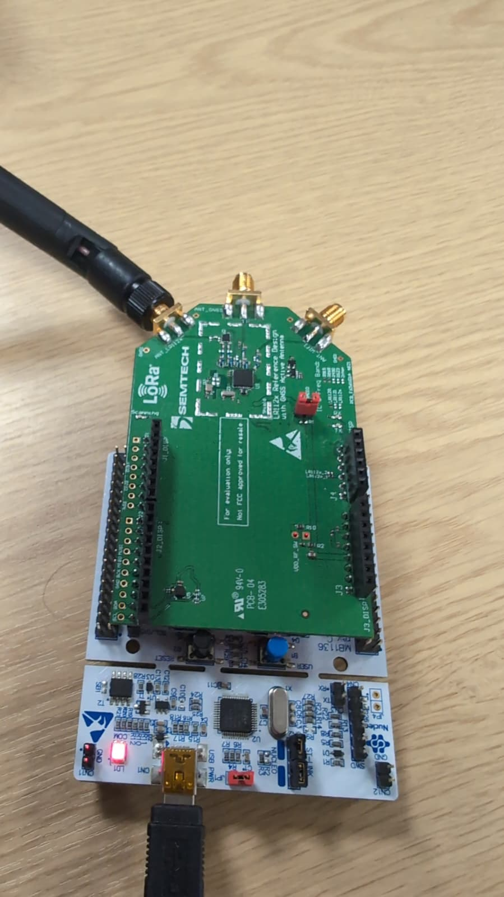

# Arduino transmitters

Two sketches, one per radio, transmitting real LR-FHSS packets so the
receiver has something to decode that no part of this project generated. The bundled
recording and the encoder both come from here or from `lrfhss.encode()`;
a live radio is the only thing that exercises actual transmitter pulse
shaping, actual carrier offset and actual noise.

| sketch | radio | status |
|---|---|---|
| `sx1262_beacon/` | SX1262 | decodes end to end; the bundled recording came from it |
| `lr1120_beacon/` | LR1120 | decodes end to end |

It beacons one packet every `BEACON_PERIOD_MS`, forever. No handshake, no
serial protocol: flash it and it transmits.

## Hardware



- ST Nucleo-L476RG
- Semtech SX1262MB2xAS mbed shield, seated on the Arduino headers
- an antenna on the shield's RF connector

The shield has one RF port, so there is nothing to get wrong: antenna in,
USB in, and the board is powered from USB alone.

The shield is an 868/915 MHz part. The sketch defaults to 915 MHz, which
is where it is matched.

Pin map, already set in the sketch for that shield:

| signal | pin |
|---|---|
| NSS | D7 |
| DIO1 | D5 |
| RESET | A0 |
| BUSY | D3 |

## Build and flash

Needs the **STM32** board package (`STMicroelectronics:stm32`, board
"Nucleo-64", board part number `NUCLEO_L476RG`) and the **RadioLib**
library, both from the IDE's manager.

From the Arduino IDE: open `sx1262_beacon/sx1262_beacon.ino`, pick the
board, upload.

From the command line:

```bash
arduino-cli compile -b STMicroelectronics:stm32:Nucleo_64:pnum=NUCLEO_L476RG \
                    --output-dir /tmp/build sx1262_beacon
st-flash --reset write /tmp/build/sx1262_beacon.ino.bin 0x08000000
```

`st-flash` is used rather than copying the `.bin` onto the board's
`NOD_L476RG` mass-storage drive, because that drag-and-drop route has
failed here **silently**: no `FAIL.TXT`, and the old firmware kept
running. If you do use the drive, check the serial output afterwards to
confirm the new sketch is the one running.

## What it transmits

| setting | default | note |
|---|---|---|
| `TEST_FREQ` | 915.0 MHz | |
| `LRFHSS_BW` | 39.06 kHz | occupied bandwidth |
| `LRFHSS_CR` | 1/3 | `RADIOLIB_LR_FHSS_CR_5_6`, `_2_3`, `_1_2`, `_1_3` |
| `LRFHSS_HDRS` | 3 | header replicas, 1..4 |
| `NARROW_GRID` | true | 3.90625 kHz grid; false gives the 25.39 kHz FCC grid |
| `HOP_SEQ_ID` | 0 | legal for every Ngrid |
| `TEST_POWER` | 10 dBm | |
| `BEACON_PERIOD_MS` | 4000 | start to start, not end to start |
| `PAYLOAD` | `"hello world"` | |
| `TCXO_VOLTAGE` | 0 | 0 = crystal. Set 1.6/1.7 only if your shield has a DIO3-fed TCXO, otherwise `begin()` fails |

One line per packet, so a log can be parsed:

```
BEACON n=41 toa_ms=6176 code=0
```

`code` is 0 on success, or a negative RadioLib error.

**`toa_ms` is not trustworthy.** RadioLib's `getTimeOnAir()` does not model
LR-FHSS correctly: it reported 6176 ms for the defaults above, while the
same transmission measured **1.02 s** off the air (3 header replicas of
233 ms plus the payload fragments). The sketch's own "time on air is close
to the beacon period" warning is derived from that number, so it fires
when there is in fact plenty of headroom. Measure from a capture if the
duty cycle matters.

## Receiving it

Whatever you change here has to be matched on the receiving side, because
neither the bandwidth nor the header-replica count is carried in the
header:

```python
lrfhss.config.retune(39.06e3, sync_word='12AD101B', hdr_count=3)
```

The sync word is RadioLib's SX126x LR-FHSS default, `0x12AD101B`, not this
receiver's own default. Grid and coding rate *are* in the header, so the
decoder recovers those by itself.

`../live_receive.py` decodes this beacon straight off an SDR and is already
set up for it.

## Note

LR-FHSS on the SX126x is **transmit only**. The chip cannot receive it,
which is the reason this project exists.


# lr1120_beacon

The same beacon on an LR1120. Everything except the radio is identical to
`sx1262_beacon`, which is the point: decode both and the only variable is
the transmitter.

## Wiring



Same mbed shield header positions as the SX1262 shield, and verified on
this bench: NSS `D7`, IRQ/DIO9 `D5`, RESET `A0`, BUSY `D3`. A `-2` from
`begin()` (chip not found) means this is wrong for your board.

Note the difference from the SX1262 photo above: this board brings out
**three** SMA ports, for sub-GHz, 2.4 GHz and a GNSS active antenna. The
antenna has to be on the sub-GHz one for the 915 MHz this sketch uses.
On the wrong port the chip still reports a successful transmit, because
nothing downstream of the RF switch is measured -- the same class of
silent failure as the sync word below.

The board is also marked "for evaluation only, not FCC approved for
resale", which is worth remembering before pointing it at an antenna
outdoors.

Two LR1120-specific things the SX1262 does not need:

- **An RF switch table.** The LR1120 drives its front-end switch from its
  own DIO5/DIO6, and `setRfSwitchTable()` returns nothing, so a wrong
  table is silent: the chip transmits into a switch still pointing at the
  receive path and almost nothing reaches the antenna. The table in the
  sketch is the DIO5/DIO6 arrangement used by the Semtech shields.
- **A TCXO.** `TCXO_VOLTAGE` is 1.6 V here. Wrong value, and `begin()`
  fails outright rather than misbehaving later.

## Measured behaviour

Flashed and confirmed on a Nucleo-L476RG: `beginLRFHSS` and
`setLrFhssConfig` both return 0, every `transmit()` returns 0, and an
RTL-SDR at 915 MHz sees **bursts of 1.44 s exactly 4.00 s apart**. That
length is right: 3 header replicas of 233.472 ms plus 7 payload fragments
of 102.4 ms, which is what 11 bytes at CR 1/3 should produce. So the
radio, the switch table and the frame structure are all correct.

It also confirms the `toa_ms` warning above from a second chip: RadioLib
reported 6176 ms for a transmission measured at 1.44 s.

## The sync word is not optional

The LR1120 needs one line the SX1262 does not, and leaving it out costs a
lot of debugging:

```c
uint8_t SYNC_WORD[4] = { 0x1B, 0x10, 0xAD, 0x12 };   // 0x12AD101B, LSB first
radio.setSyncWord(SYNC_WORD, sizeof(SYNC_WORD));
```

RadioLib builds the LR-FHSS frame two different ways. For the SX126x it
builds it **in software**, with the sync word 0x12AD101B hardcoded in
`SX126x_LR_FHSS.cpp`. For the LR11x0 it hands the job to the **chip**
(`lrFhssBuildFrame`), and the chip's sync word is a register that RadioLib
writes only from `setSyncWord()`. `beginLRFHSS()` never touches it, so
without the call above the radio transmits with whatever reset left in
that register.

That failure is nasty because nothing reports it. The frame is
structurally perfect -- correct dwell timing, bandwidth, grid, modulation
index -- and a receiver still finds partial sync correlations by chance,
locks its header window in the wrong place, and decodes noise. Measured
here, before and after the one line:

| | no sync word set | sync word set |
|---|---|---|
| matched-filter correlation | 724 / 704 / 455 | 1320 / 1270 / 1260 |
| offline decode | nothing | `hello world`, payloadlen 11, CR 1/3 |
| live decode over 44 s | 0 packets | 17 packets, 0 dropped |

The order matters: `setSyncWord` dispatches on the active modem and only
routes four bytes to the LR-FHSS sync word once LR-FHSS is running, so it
has to come after `beginLRFHSS()`. The sketch prints the sync word at boot
so a regression is visible without a receiver.

Semtech's own driver is the giveaway that this is per-application rather
than a chip default: `lr11xx_lr_fhss_build_frame()` takes the sync word as
a parameter, set through `lr11xx_radio_set_lr_fhss_sync_word()`.
